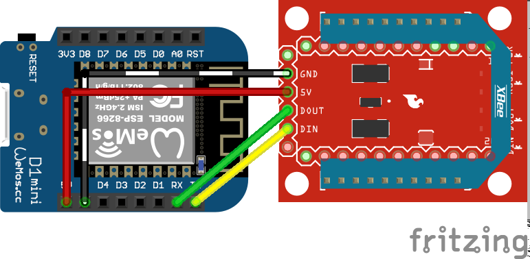

# Secure by design microcontroller
This software is written to securely collect all messages that are received by the Coordinator of a Zigbee network. The software consists of two different parts. The Coordinator and the End device modules.
The software is written for the Wemos D1 microcontroller and the Digi XBee.

## Overview
Below is a short overview of the most important software components.

#### End Device
The software will switch to End Device mode when the connected XBee module has CE disabled.
In End Device mode the microcontroller sends data messages containing mock data from measurements.
The End Device calculates the hash of the message and sends the hash and the data in a JSON structure.

#### Message
The messages sent by end devices in the Zigbee network should look like this:
```json
{
  "sensorAddr" : "13a200418f12ce",
  "messageCount" : 100,
  "data" : "00|00|00|64|2D|0C|15|24",
  "hash" : "2AC7379FC3AF0B6CB978A33F8E9227F36C23309B676E3057BD0BC58F113A30EC"
}
```
* The end device software contained in this repo makes sure a message always conforms to this style.
* The sensorAddr in the JSON above is the hex string of the IEEE64 address of the sending XBee.
* The messageCount contains the amount of messages this client has sent(int32).
* The data consists of hex values seperated by a pipe `|` symbol.
* The hash contains hex values that are combined into a large hex string.

#### Coordinator
The software will switch to Coordinator mode when the connected XBee module has CE enabled.
In Coordinator mode all Zigbee messages received by the coordinator are published to MQTT.
A message is published using the IEE64 address of the XBee as a topic. 
This way all the messages of a single devices are grouped together.

#### Backend
This software can be used in combination with a backend. This backend will check hashes and publish messages to a safe topic when the hash matches. This checked topic can be used by other applications to read the messages sent by the Zigbee network.<BR>
An example of a backend can be found [here](https://github.com/DeMoordMuis/Securitysystemzigbee). This backend checks messages and displays errors when they occur.

## Getting started
Make sure you have XCTU, Visual Studio Code and Platformio installed.

#### Step 1
Change the settings in Utils/constants.h for your configuration.
With the correct settings flash two Wemos D1 microcontrollers.

#### Step 2
Setup two XBee units using XCTU. Flash one of the units using the supplied Coordinator profile.<BR>
Flash the other unit using the End device profile.
The profiles can be found in the xbee_setup folder.

#### Step 3 (Optional)
Enable Zigbee encryption in XCTU for the Coordinator and the End Device.<BR>
Please note that the encryption key is write only. It can not be read from the XBee device after it is disconnected from the computer. Make sure to test if the devices can send messages to each other using the serial monitor in XCTU.

#### Step 4
Connect the microcontrollers to the XBee units like below:
This way the XBee is powered by the Wemos.<BR>
The Wemos can be connected to the computer for debugging.



#### Step 5 (Optional)
Check if everything works using a MQTT client. Subscribe to the correct topic.
This topic can be found when the Coordinator is connected to the pc and the terminal is read.
When a message is published the topic will be printed.

#### Step 6 (Optional)
Connect the [backend](https://github.com/DeMoordMuis/Securitysystemzigbee) to the MQTT broker.
Make sure to change the settings of the backend to reflect your configuration.
The IEEE64 addresses of the XBee units need to be added to the whitelist of the backend in order for it to work correctly.

